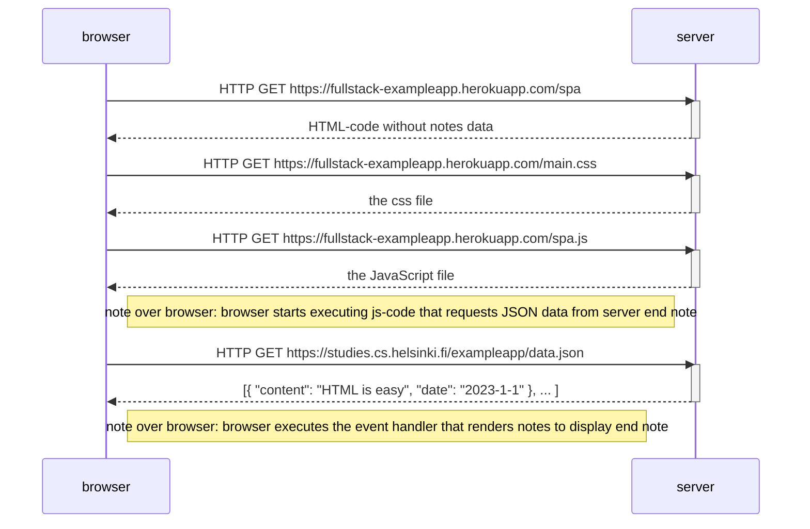

```mermaid
sequenceDiagram
    participant browser
    participant server
    
    browser->>server: HTTP GET https://fullstack-exampleapp.herokuapp.com/spa
    activate server
    server-->>browser: HTML-code without notes data
    deactivate server

    browser->>server: HTTP GET https://fullstack-exampleapp.herokuapp.com/main.css
    activate server
    server-->>browser: the css file
    deactivate server

    browser->>server: HTTP GET https://fullstack-exampleapp.herokuapp.com/spa.js
    activate server
    server-->>browser: the JavaScript file
    deactivate server

    Note right of browser: note over browser: browser starts executing js-code that requests JSON data from server end note

    browser->>server: HTTP GET https://studies.cs.helsinki.fi/exampleapp/data.json
    activate server
    server-->>browser: [{ "content": "HTML is easy", "date": "2023-1-1" }, ... ]
    deactivate server

    Note right of browser: note over browser: browser executes the event handler that renders notes to display end note
    
```
