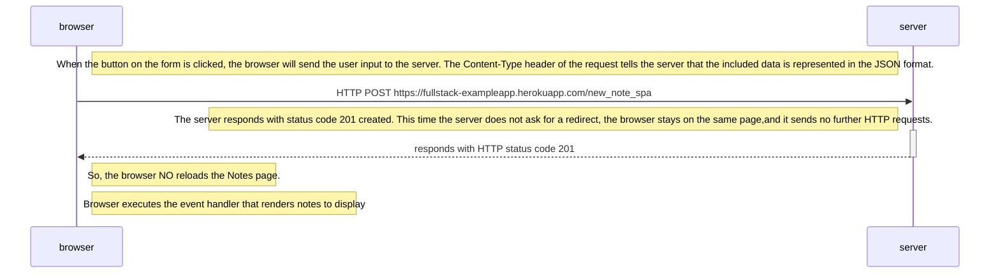

```mermaid
sequenceDiagram
    participant browser
    participant server
  
    Note right of browser: When the button on the form is clicked, the browser will send the user input to the server. The Content-Type header of the request tells the server that the included data is represented in the JSON format.
  
    browser->>server: HTTP POST https://fullstack-exampleapp.herokuapp.com/new_note_spa
    
    Note left of server: The server responds with status code 201 created. This time the server does not ask for a redirect, the browser stays on the same page,and it sends no further HTTP requests.
    
    activate server
    server-->>browser: responds with HTTP status code 201
    deactivate server
    
    Note right of browser: So, the browser NO reloads the Notes page.
    Note right of browser: Browser executes the event handler that renders notes to display
    
```
